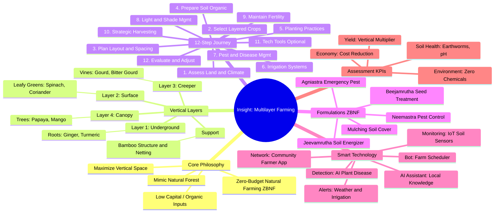

# 🌿 Insight: Multilayer Farming Roadmap

Welcome to the **Insight Multilayer Farming** documentation. This roadmap provides a structured path for farmers to transition to a sustainable **Multilayer Model**.

## 🗺️ Project Mindmap

The following mindmap summarizes the entire journey, from core philosophy and vertical layering to the 12-step execution roadmap and advanced technological integrations.

## 🚀 How to Use This Roadmap

1.  **Assess Your Land**: Start with [Land Evaluation](/docs/multilayer-farming/access-land-and-climate-condition) to check if your soil and drainage are ready.
2.  **Learn the Layers**: Understand how to [select and stack crops](/docs/crop-selection-and-layering) for maximum yield.
3.  **Follow the Phases**: Move through the [Execution Phases](/docs/execution-phases) step-by-step, starting with a small test plot.
4.  **Integrate Tech**: Explore [Advanced Technology](/docs/advanced-technology) to automate reminders and monitor soil health.
5.  **Manage Pests Organically**: Use [Pest & Disease Management](/docs/pest-and-disease-management) techniques like Neemastra.

---

*This project is adapted for the Bangladesh context, focusing on local crop varieties and affordable technology.*
