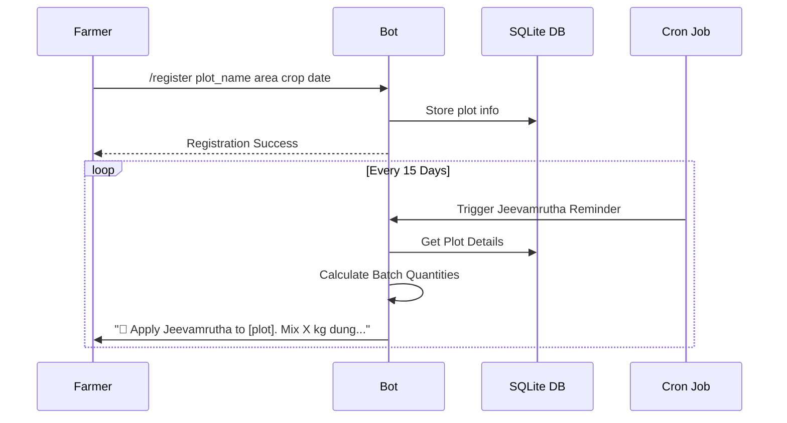

# 🔔 A. Farm Scheduler & Reminder System

## Overview

A Telegram-based bot that sends automated reminders to farmers for all recurring ZBNF tasks — Jeevamrutha application, mulch checks, irrigation schedules, and pest spray timing.

## Problem It Solves

Farmers forget recurring tasks like applying Jeevamrutha every 15 days or checking mulch condition. Missed applications directly reduce soil microbial activity and crop health.

## Core Features

| Feature | Description |
|---|---|
| Plot registration | Register multiple plots with crop, area (decimals/bigha), and start date |
| Jeevamrutha reminders | Auto-remind every 15 days per plot with batch size calculated from area |
| Mulch check alerts | Weekly reminder to inspect and replenish mulch layer |
| Spray schedule | Neemastra preventive spray reminder every 14 days |
| Irrigation advisory | "Check soil moisture before watering" reminders based on season |
| Custom reminders | Farmer can set their own one-time or recurring reminders |

## Tech Stack

| Component | Technology | Cost |
|---|---|---|
| Bot framework | Telegram Bot API via `telegraf` (Node.js) or `python-telegram-bot` | Free |
| Database | SQLite (file-based, no server needed) | Free |
| Scheduling | `node-cron` or `APScheduler` (Python) | Free |
| Hosting | Railway.app free tier / Render.com free tier / GitHub Actions (cron) | Free |

## How It Works

## Key Design Decisions

- **Telegram over custom app**: Most rural Bangladesh farmers already have Telegram or can install it. No need to build a custom mobile app.
- **SQLite over cloud DB**: Zero cost, zero setup. The bot and DB live on the same free-tier server.
- **Batch size calculator built-in**: When reminding about Jeevamrutha, the bot calculates exact quantities based on registered plot area (e.g., "For your 20 decimal plot: 10 kg cow dung, 5L urine, 2 kg gur, 2 kg besan, 200L water").

## SMS Fallback (Optional)

For farmers without smartphones, integrate with a local SMS gateway. The bot sends the same reminders via SMS. Many BD telcos offer developer-friendly SMS APIs with free tiers or very low cost.

## Complexity

🟢 **Beginner** — 1–2 days to build and deploy.

## References

- [Telegram Bot API docs](https://core.telegram.org/bots/api)
- [Telegraf.js](https://telegraf.js.org/)
- [Railway.app](https://railway.app/)
