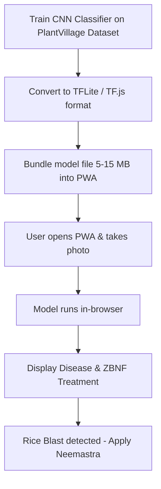

# 🌱 C. Plant Disease Detection — On-Device, No API Cost

## Overview

A mobile-friendly tool where farmers photograph a sick leaf and get a disease name + ZBNF treatment suggestion. All inference runs **locally on the device** — no cloud AI, no API key, no per-request cost.

## Problem It Solves

Farmers see yellow spots, wilting, or unusual leaf patterns but don't know what disease it is or which ZBNF formulation to apply. Currently, they either ignore it (losing crop) or panic-buy market pesticides (breaking ZBNF principles).

## Two Approaches

### Approach 1: PlantNet API (Simplest — 1 day build)

| Component | Details |
|---|---|
| API | [PlantNet API](https://my.plantnet.org) — free tier, 500 requests/day, no credit card |
| How | Upload leaf photo → API returns plant + disease identification |
| Limitation | Needs internet; 500/day limit (enough for personal/small group use) |
| Best for | Quick MVP to validate the idea |

### Approach 2: On-Device TensorFlow.js (No internet needed)

| Component | Technology | Cost |
|---|---|---|
| ML Model | TensorFlow Lite / ONNX Runtime | Free |
| Training data | [PlantVillage Dataset](https://www.kaggle.com/datasets/abdallahalidev/plantvillage-dataset) — 54,000+ images, 38 disease classes | Free |
| Training | Train on your laptop with TensorFlow/FastAI (one-time, few hours) | Free (electricity only) |
| Inference | TensorFlow.js in browser — runs on phone GPU/CPU | Free |
| App shell | PWA (installable, works offline) | Free |
| Hosting | GitHub Pages / Netlify | Free |

## How the On-Device Version Works

## Disease → ZBNF Treatment Mapping (Example)

| Disease | Crop | ZBNF Treatment |
|---|---|---|
| Rice Blast | Rice | Neemastra foliar spray + extra Jeevamrutha at root zone |
| Leaf Blight | Rice | Brahmastra spray (neem + custard apple + datura leaf mix) |
| Bacterial Wilt | Tomato | Beejamrutha root drench + increase mulch |
| Powdery Mildew | Vegetables | Sour buttermilk spray (1:10 dilution) |
| Aphid infestation | Multiple | Neemastra spray every 3 days until controlled |
| Fruit borer | Brinjal/Tomato | Agniastra spray (chilli + garlic + tobacco + neem) |

## Key Design Decisions

- **Start with rice diseases only**: Rice is Bangladesh's #1 crop. A model that detects 5-6 common rice diseases is more useful than a generic 38-class model.
- **Offline-first**: Rural Bangladesh has poor connectivity. The model MUST work without internet.
- **Bangla output**: All disease names and treatment instructions displayed in simple Bangla.
- **No AI API dependency**: The model is a one-time download bundled with the app. Zero ongoing cost.

## Recommended Start

Start with **Approach 1** (PlantNet API) to validate the concept in 1 day. Then build **Approach 2** (on-device) over 3-5 days as the permanent solution.

## Complexity

🟢 Beginner (PlantNet API version) — 1 day
🟡 Intermediate (On-device TF.js version) — 3–5 days

## References

- [PlantVillage Dataset on Kaggle](https://www.kaggle.com/datasets/abdallahalidev/plantvillage-dataset)
- [TensorFlow.js](https://www.tensorflow.org/js)
- [PlantNet API](https://my.plantnet.org)
