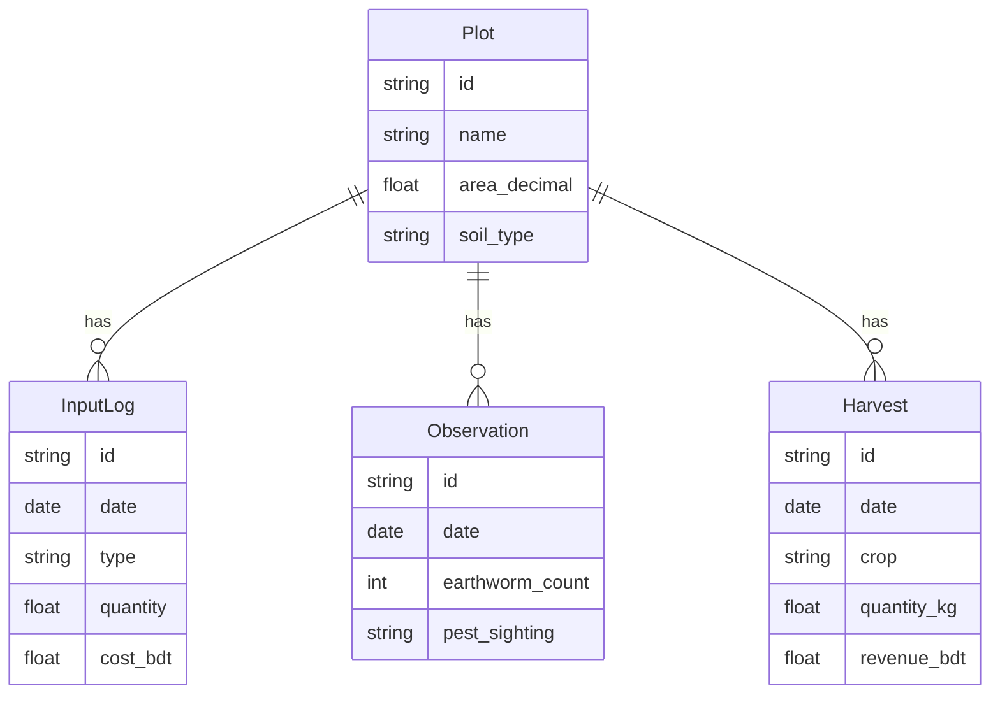

# 📊 D. Farm Record Keeping & Yield Tracker

## Overview

A tool to track all ZBNF inputs, costs, crop growth stages, and harvest yields — with season-over-season comparison to prove ZBNF savings vs chemical farming.

## Problem It Solves

Farmers switch to ZBNF but can't quantify their savings. Without records, they can't prove (to themselves or others) that ZBNF actually costs less. Records also help identify which formulations work best for which crops.

## Two Build Options

### Option 1: Google Sheets + Apps Script (No-Code, Shareable)

| Component | Details |
|---|---|
| Platform | Google Sheets (free forever, accessible on any phone) |
| Automation | Google Apps Script for auto-calculations and email reminders |
| Sharing | Share a single sheet link with a farming group |
| Offline | Google Sheets has limited offline mode on mobile |

**Features via Apps Script:**
- Auto-calculate Jeevamrutha batch quantity from acreage input
- Generate seasonal yield comparison charts automatically
- Send email reminders for upcoming tasks
- Pre-built templates for input logging, cost tracking, harvest recording

### Option 2: React PWA + IndexedDB (Full App, Fully Offline)

| Component | Technology | Cost |
|---|---|---|
| Frontend | React + Vite (or plain HTML/JS) | Free |
| Storage | IndexedDB via Dexie.js | Free |
| Charts | Chart.js or Recharts | Free |
| Export | jsPDF for PDF reports, Papa Parse for CSV | Free |
| Hosting | GitHub Pages / Netlify / Vercel | Free |
| Offline | Service Worker + Workbox | Free |

## Data Model (for PWA option)

## Key Reports to Generate

| Report | Purpose |
|---|---|
| **Cost comparison** | ZBNF input cost vs previous chemical season — show ৳ saved |
| **Yield trend** | Yield per decimal over 3+ seasons — shows improvement curve |
| **Input frequency** | How often each formulation was applied — helps optimize schedule |
| **Soil health index** | Earthworm count + moisture trend over time |
| **ROI calculator** | Revenue minus input cost — net profit per bigha |

## Key Design Decisions

- **Data stays on phone**: No cloud upload needed. Farmers own their data.
- **CSV export**: For farmers who want to share data with agricultural officers or researchers.
- **PDF seasonal report**: A printable summary to show neighbors or at farmer group meetings.
- **Bangla labels**: All field names and chart labels in Bangla.

## Complexity

🟢 Beginner (Google Sheets version) — 1–2 days
🟡 Intermediate (PWA version) — 1 week

## References

- [Google Apps Script](https://developers.google.com/apps-script)
- [Dexie.js (IndexedDB wrapper)](https://dexie.org/)
- [Chart.js](https://www.chartjs.org/)
- [jsPDF](https://github.com/parallax/jsPDF)
