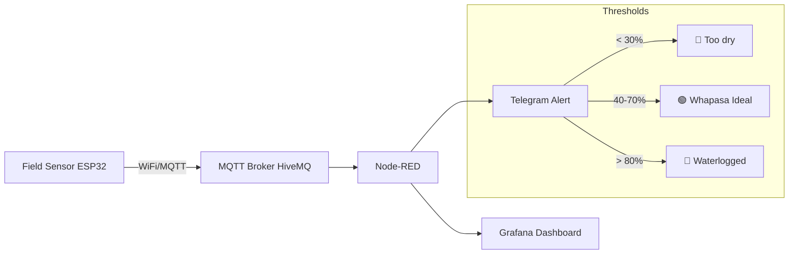

# 🌡️ E. Low-Cost IoT Soil Monitoring

## Overview

A hardware + software system that reads real-time soil moisture, temperature, and humidity from the field and alerts you when irrigation is actually needed — based on measured data, not guesswork. Upholds the ZBNF **Whapasa** principle with sensor precision.

## Problem It Solves

ZBNF's Whapasa principle says soil needs both moisture AND air. But how wet is "too wet"? How dry is "too dry"? Without measurement, farmers either over-irrigate (killing aerobic microbes) or under-irrigate (stressing crops). A ৳1,000 sensor setup removes the guesswork.

## Hardware Components

| Component | Purpose | Approx. Cost (BDT) | Source |
|---|---|---|---|
| ESP32 microcontroller | Brain — reads sensors, sends data via WiFi | ৳300–400 | Daraz, local electronics shops |
| Capacitive soil moisture sensor | Measures soil moisture without corrosion | ৳100–150 | Daraz, electronics bazaar |
| DHT22 sensor | Temperature + humidity (air) | ৳80–120 | Same |
| Jumper wires + breadboard | Connections | ৳50–100 | Same |
| Optional: 5V solar panel + battery | Field power without electricity | ৳400–600 | Daraz, solar shops |
| **Total per plot** | | **৳930–1,370** | |

> This is less than the cost of one bag of urea fertilizer — and it gives you data every season forever.

## Software Stack

| Component | Technology | Cost |
|---|---|---|
| ESP32 programming | Arduino IDE | Free |
| Data transmission | MQTT protocol | Free |
| MQTT broker | `broker.hivemq.com` (public, free) or Mosquitto (self-hosted) | Free |
| Data processing | Node-RED (visual flow programming) | Free |
| Dashboard | Grafana (real-time charts) | Free |
| Alerts | Telegram Bot (reuse from Tool A) | Free |
| Host Node-RED + Grafana | Raspberry Pi or old laptop at home | Free (own hardware) |

## How It Works

## Alert Thresholds (Configurable)

| Soil Moisture | Status | Action |
|---|---|---|
| < 30% | 🔴 Too dry | Irrigate immediately, add mulch |
| 30–40% | 🟡 Getting dry | Plan irrigation within 24 hours |
| 40–70% | 🟢 Whapasa (ideal) | No action — perfect balance |
| 70–80% | 🟡 Getting wet | Stop irrigation, monitor |
| > 80% | 🔴 Waterlogged | Stop irrigation, improve drainage, check mulch |

## Key Design Decisions

- **Capacitive sensor over resistive**: Resistive sensors corrode in weeks. Capacitive sensors last years.
- **MQTT over HTTP**: Lightweight, designed for IoT, works on poor connections.
- **Public MQTT broker**: For initial setup. Migrate to self-hosted Mosquitto on Raspberry Pi for privacy later.
- **Solar power optional**: If the field has WiFi range from home, ESP32 can run on a USB power bank for weeks. Solar is for remote fields.

## Limitations

- Requires WiFi range from home to field (or a mobile hotspot).
- ESP32 needs basic soldering/wiring skills.
- Not waterproof by default — needs a simple plastic enclosure for monsoon.

## Complexity

🟡 **Intermediate** — Requires basic electronics comfort + Arduino coding. 2–3 days for first working prototype.

## References

- [ESP32 Arduino documentation](https://docs.espressif.com/projects/arduino-esp32/)
- [HiveMQ public MQTT broker](https://www.hivemq.com/mqtt/public-mqtt-broker/)
- [Node-RED](https://nodered.org/)
- [Grafana](https://grafana.com/oss/grafana/)
