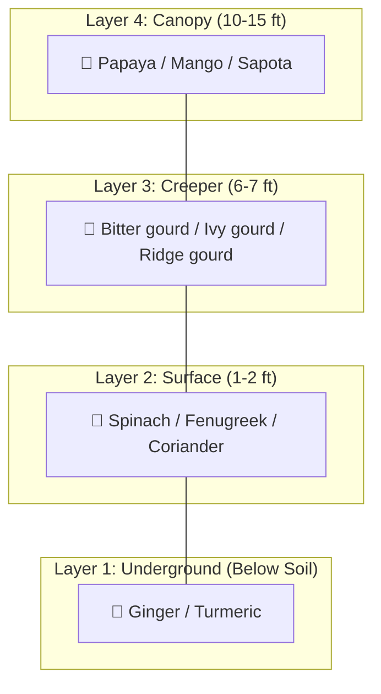

# 🌿 Akash Chaurasia's Multi-Layer Farming Technique

> **Source:** Akash Chaurasia — Organic farmer from Sagar, Madhya Pradesh, India. Recognized nationally for developing a practical, low-cost multilayer farming model for small landholders.

---

## Who is Akash Chaurasia?

Akash Chaurasia is an innovative Indian farmer from Sagar district, Madhya Pradesh, who developed and popularized a **multilayer farming model** that allows small farmers to grow 4+ crops simultaneously on the same piece of land. His technique mimics the vertical structure of a natural forest — multiple "stories" of crops that don't compete with each other. He has been featured in national media and teaches his methods to thousands of farmers.

---

## Core Concept: Farming Like a Forest

A natural forest has multiple layers — ground cover, shrubs, mid-height trees, and tall canopy. Each layer uses a different slice of sunlight, soil depth, and air space. Akash's model replicates this in a farm setting:

---

## The Four Layers Explained

### Layer 1: Underground (Root Crops)
- **What grows here:** Ginger, turmeric, elephant foot yam
- **Root zone:** Deep (6–12 inches)
- **Why it works:** These crops grow entirely below the surface. They don't compete for sunlight with above-ground crops.
- **Harvest cycle:** 6–9 months (long-term income)

### Layer 2: Surface / Ground Level (Leafy Greens)
- **What grows here:** Spinach (পালং শাক), fenugreek/methi (মেথি), coriander (ধনেপাতা), amaranthus (লাল শাক)
- **Root zone:** Shallow (top 2 inches)
- **Why it works:** Fast-growing, harvested repeatedly (cut-and-come-again). Dense growth suppresses weeds — reportedly 80% weed reduction.
- **Harvest cycle:** 30–45 days (quick income, repeatable)

### Layer 3: Creeper / Vine Level
- **What grows here:** Bitter gourd (করলা), ivy gourd/kundru, ridge gourd (ঝিঙা), scarlet gourd, bottle gourd (লাউ)
- **Structure needed:** Bamboo frame + netting at ~6.5 feet height
- **Why it works:** Vines grow upward on the support structure. Their leaves provide partial shade to the ground layer below, protecting sensitive leafy greens from harsh sun.
- **Harvest cycle:** 60–90 days (medium-term income)

### Layer 4: Tree / Canopy Level
- **What grows here:** Papaya (পেঁপে), mango (আম), sapota/chikoo
- **Spacing:** Planted at wider intervals (8–10 ft apart) so they don't overshadow the structure
- **Why it works:** Fruit trees are the longest-term investment. They form the highest canopy and provide additional filtered shade.
- **Harvest cycle:** 6–18 months (long-term income)

---

## Structure & Layout

### Bamboo Support Structure
- **Height:** ~6.5 feet (2 meters) — allows farmer to walk and work underneath
- **Material:** Bamboo poles + natural netting (jute rope mesh or grass/straw lattice on top)
- **Cost:** Very low — bamboo is cheap and locally available
- **Purpose:** Supports vine crops AND provides shade management for lower layers

### Spacing Guidelines (from Akash's Model)

| Component | Spacing |
|---|---|
| Fruit trees (papaya) | 8–10 ft apart in grid pattern |
| Bamboo poles | 6–8 ft apart, connecting horizontal beams |
| Vine crops | Planted at base of bamboo poles, trained upward |
| Leafy greens | Dense broadcast sowing in all available ground space |
| Root crops | Planted in rows between bamboo poles |

---

## Akash's Crop Combinations

### Classic 4-Layer Combination

| Layer | Crop | Harvest Time | Income Type |
|---|---|---|---|
| Underground | Ginger or Turmeric | 6–9 months | Bulk seasonal |
| Ground | Spinach + Fenugreek + Coriander | 30–45 days (repeating) | Weekly cash |
| Vine | Bitter gourd + Ivy gourd | 60–90 days | Regular |
| Tree | Papaya | 8–12 months | Premium |

### Alternative Combinations (from Akash's teachings)

**Combination 2:**
| Layer | Crop |
|---|---|
| Underground | Turmeric |
| Ground | Amaranthus + Coriander |
| Vine | Ridge gourd + Bottle gourd |
| Tree | Mango (long-term) |

**Combination 3:**
| Layer | Crop |
|---|---|
| Underground | Elephant foot yam |
| Ground | Spinach + Radish |
| Vine | Scarlet gourd |
| Tree | Sapota (Chikoo) |

---

## Key Principles

1. **Root zone separation** — Each layer's roots occupy different soil depths → no nutrient competition
2. **Light management** — Upper layers provide filtered light, not total shade → protects lower crops from heat stress
3. **Weed suppression** — Dense ground-layer planting leaves no space for weeds
4. **Water efficiency** — Layered canopy reduces evaporation; mulch between layers retains moisture
5. **Year-round income** — Staggered harvest cycles ensure weekly cash flow
6. **Organic-only inputs** — Akash uses vermicompost and bio-pesticides exclusively
7. **Low capital** — Bamboo structure + seeds are the only setup costs

---

## Irrigation

Akash recommends **drip irrigation** for multilayer setups:
- Delivers water directly to root zones of different layers
- Prevents waterlogging
- Saves 50–70% water compared to flood irrigation
- Can be set up cheaply with local drip pipes

---

## References & Citations

- [The Better India — "How Akash Chaurasia Earns ₹9 Lakh From One Acre With Multi-Layer Farming"](https://www.thebetterindia.com/265370/akash-chaurasia-multi-layer-farming/)
- [Down to Earth — "Multi-layer Farming: Growing More With Less"](https://www.downtoearth.org.in/agriculture/multi-layer-farming-growing-more-with-less)
- [Wikipedia — Akash Chaurasia](https://en.wikipedia.org/wiki/Akash_Chaurasia)
- [VK Group India — Multilayer Farming Technique](https://vkgroupindia.in/)
- [YouTube — Search "Akash Chaurasia multilayer farming"](https://www.youtube.com/results?search_query=akash+chaurasia+multilayer+farming) for visual demonstrations
